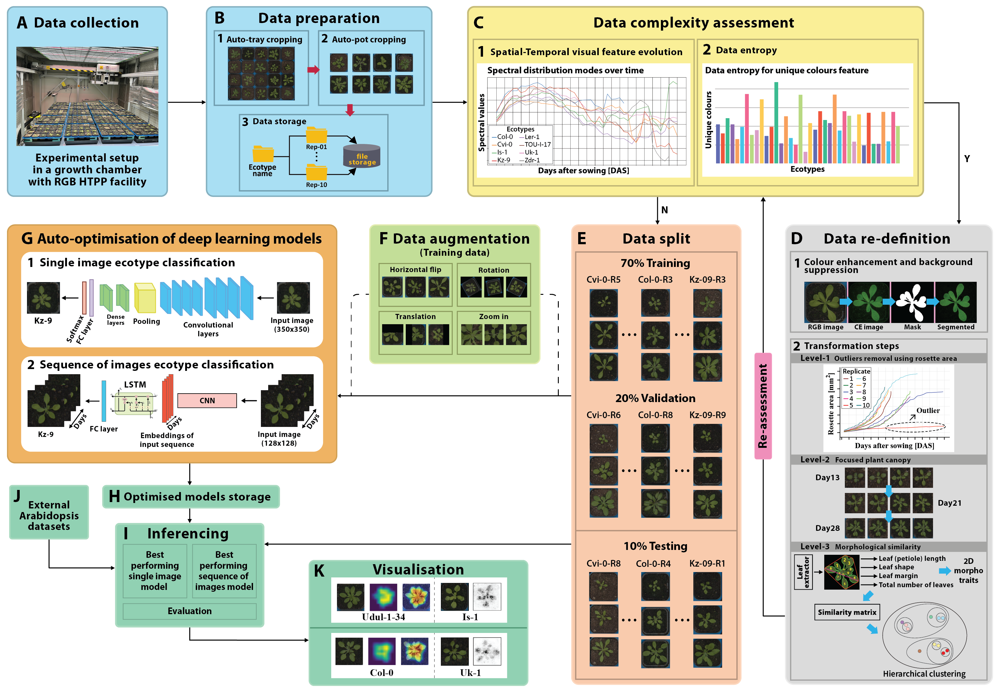

# Computer-based Recognition of Arabidopsis thaliana Ecotypes

This repository provides the full source code developed to classify various A. thaliana ecotypes using an RGB image analysis pipeline. This pipeline operates with a large volume of data collected by an X-Y indoor HTPP system.


## Description

The RGB image analysis pipeline consists of several elements (see Figure 1):
A – Collection of RGB image data in an indoor HTPP environment, B – Preparation and organization of the data using auto-pot and auto-cropping procedures, C – Assessment of complexity (variability) within generated datasets, D – Data re-definition sub-component composed of GUI-based image processing and three levels of transformation, E – Partitioning data into training, validation, and test sets, F – Data augmentation using random affine transformations, G – Auto-optimization sub-system that performs single-image and sequence-of-images classification, H – Storage of the best-performing deep learning models, I –Inferencing on test data as well as J – externally sourced data,  K – Visualization of critical regions using heat and saliency maps.



**Figure 1**. The complete workflow of the developed RGB image analysis pipeline for the recognition of various Arabidopsis ecotypes.

## Requirements
- [python>=3.7](https://www.python.org/downloads/)
- [torch>=1.4](https://pytorch.org/get-started/locally/)
- [matplotlib](https://pypi.org/project/matplotlib/)
- [numpy](https://pypi.org/project/numpy/)
- [pandas](https://pypi.org/project/pandas/)
- [opencv-python](https://pypi.org/project/opencv-python/)
- [jupyter notebook](https://jupyter.org/)
- [Microsoft Visual Studio >=2022](https://visualstudio.microsoft.com/vs/)

## Structure
The fundamental filesystem structure resembles the tree shown below. Essentially, we have two main folders: ```code``` for storing scripts and ```data``` for storing the dataset.
```console
├── code
│   ├── 02_auto-cropping
│   ├── 03_data_complexity
│   │   ├── 01_extracted_features
│   │   │   └── internal_datasets
│   │   ├── 02_feature_evolution
│   │   └── 03_feature_extraction
│   ├── 04_data_re_definition
│   │   ├── 01_GUI
│   │   │   └── PlantEnhancer
│   │   │       ├── Properties
│   │   │       ├── bin
│   │   │       │   ├── Debug
│   │   │       │   └── Release
│   │   │       └── obj
│   │   │           ├── Debug
│   │   │           └── Release
│   │   ├── 02_rosette_area
│   │   ├── 03_canopy_focus
│   │   ├── 04_2D_morpho_traits
│   │   └── 05_clustering
│   │       ├── LTU-1_dataset
│   │       └── LTU-2_dataset
│   └── 05_modelling
│       ├── data_split_configs
│       ├── inferencing
│       ├── pytorch_utils
│       ├── sequence_of_images_classification
│       └── single_image_classification
├── data
│   ├── LTU-1_dataset
│   │   ├── 01_pot_img_samples
│   │   │   └── zdr_-1_rep_05
│   │   ├── 02_GUI_output
│   │   │   └── zdr_-1_rep_05_out1
│   │   │       ├── CE_imgs
│   │   │       ├── masks
│   │   │       └── segmented_imgs
│   │   └── 03_canopy_focused
│   │       └── zdr-1_rep_05_focused
│   └── LTU-2_dataset
│       ├── 01_pot_img_samples
│       │   └── Is-1_rep_38
│       ├── 02_GUI_output
│       │   └── Is-1_rep_38_out1
│       │       ├── CE_imgs
│       │       ├── masks
│       │       └── segmented_imgs
│       └── 03_canopy_focused
│           └── Is-1_rep_38_focused
└── scratch_trained_models
    ├── LTU-1_models
    └── LTU-2_models
```

## How to use
### Prerequisites
Each folder contains the code for each task. Please go into each folder to find the required packages and install them before running the code. We recommend using [Conda](https://conda.io/projects/conda/en/latest/user-guide/install/index.html) to manage the environments better.
```
conda create -n env_name 
conda activate env_name
pip install -f requirements.txt
```

### Data
Some raw collected data samples together with canopy-focused images as well as GUI outputs can be accessed [here](data).

### Models
The models trained from scratch during the auto-optimization process for classifying ecotypes in both single-image and sequence-of-images settings can be found [here](trained_models).

## LICENSE
This repo is distributed under [LICENSE](LICENSE).
