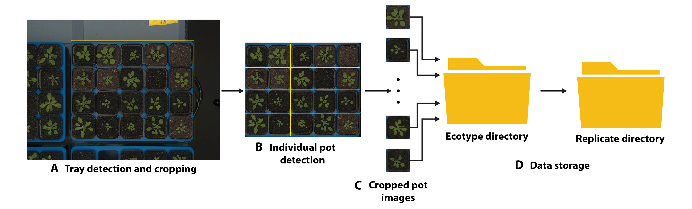

## Data Preparation and Organisation

Auto-tray cropping was established by using a set of coordinates (top-left and bottom-right parts of the image) that belong to the main tray visible in the RGB image. After that, cropped tray images were stored in the database and structured based on the unique TRAY_ID available in the growth chamber. Auto-pot cropping procedure was established by randomly generating labels in the form of bounding boxes and manually positioning labels around the pots of used trays. Upon successful pot detection, a set of coordinates corresponding to each POT_ID was stored in a metadata file and further used to crop identified pots. Cropped pot images were stored in the following directory format Ecotype_name -> Rep_ID -> sequence of pot images.

**Figure 2**. Workflow of data preparation and organisation: A - source image with detected tray, B - Cropped tray image, C - cropped pot images, D - Storage of generated RGB images in specific ecotype and replicate directory.